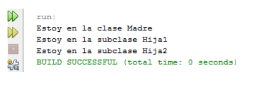

# 3. Polimorfisme

La sobreescriptura de mètodes és la base d'un dels conceptes més potents de Java: **la selecció dinàmica de mètodes**. Aquest mecanisme resol les crides a mètodes sobreescrits **durant el temps d'execució**, no en temps de compilació. Això permet implementar el **polimorfisme** en temps d'execució.

En Java, una **variable de referència** a una superclasse pot referir-se a un objecte d'una subclasse. Així, el tipus de l'objecte referenciat, i no el tipus de la variable, determina quina versió del mètode s'executa.

El **polimorfisme** és essencial en la programació orientada a objectes perquè permet que una **classe general** defineixi mètodes comuns per a totes les seues subclasses. Aquestes subclasses poden, si ho necessiten, redefinir o implementar de nou alguns d'aquests mètodes per adaptar-los al seu comportament específic.

A través de la combinació de **herència** i **sobreescriptura de mètodes**, una superclasse pot definir la forma general dels mètodes que utilitzaran les subclasses, alhora que dona la flexibilitat perquè aquestes personalitzen la seua implementació. Això fa que el polimorfisme siga una eina fonamental per a escriure codi reutilitzable i adaptable.

## 3.1 Exemple 4

Anem a provar un exemple senzill però que resumeix tot el que és important del polimorfisme.  
Anem a crear la classe **Mare** amb un mètode **llamame()**. A continuació, crearem dues classes derivades d'aquesta: **Hija1** i **Hija2**, sobreescrivint el mètode **llamame()**. En el **main**, crearem un objecte de cada classe i els assignarem a una variable de tipus **Mare** (anomenada **madre2**) amb la qual anomenarem al mètode **llamame()** dels tres objectes.  

És important observar que <u>la variable **Mare madre2** es pot assignar a objectes de classe **Hija1** i **Hija2**</u>. Això és <u>possible perquè **Hija1** i **Hija2** també són de tipus **Mare**</u> (a causa de l'herència).

També és important veure que <u>la variable **Mare madre2** cridarà al mètode **llamame()** de la classe de l'objecte al qual fa referència</u> (a causa del polimorfisme).  

Observe's les anomenades **madre2.llamame()** de les línies 36 d'ara en avant:

- En el primer cas, s'invoca al mètode **llamame()** de la classe **Mare** perquè **madre2** fa referència a un objecte de la classe **Mare**.  
- En el segon cas, s'invoca al mètode **llamame()** de la classe **Hija1** perquè ara **madre2** fa referència a un objecte de la classe **Hija1**.  
- En el tercer cas, s'invoca al mètode **llamame()** de la classe **Hija2** perquè ara **madre2** fa referència a un objecte de la classe **Hija2**.

