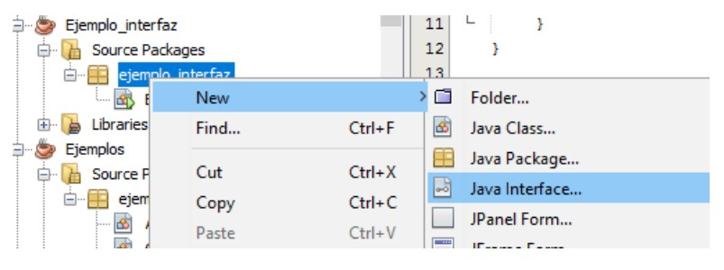
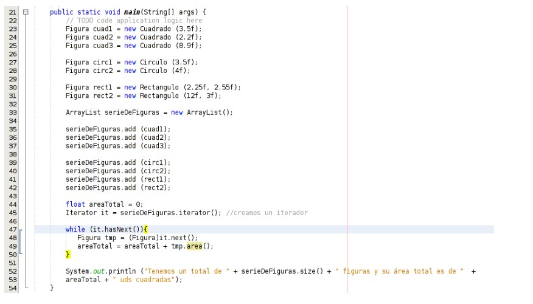

# 5. Interfícies

Una interfície és una **declaració d'atributs i mètodes sense implementació** (sense definir el codi dels mètodes). S'utilitzen per a definir el conjunt mínim d'atributs i mètodes de les classes que implementen aquesta interfície. En certa manera, és paregut a una classe abstracta amb tots els seus membres abstractes.

Si una classe és una plantilla per a crear objectes, **una interfície és una plantilla per a crear classes**.

>[!IMPORTANT]<strong>IMPORTANT!</strong>
>Una interfície és una declaració d'atributs i mètodes sense implementació.

Mitjançant la construcció d'una interfície, el o la programadora pretén especificar què caracteritza a una col·lecció d'objectes i, igualment, especificar quin comportament han de reunir els objectes que vulguen entrar dins d’eixa categoria o col·lecció.

En una interfície també es poden declarar constants que defineixen el comportament que han de suportar els objectes que vulguen implementar aqueixa interfície. La sintaxi típica d'una interfície és la següent:

```java
public interface Nom {
  //Declaració d'atributs i mètodes (sense definir codi)
}
```

Si una interfície defineix un tipus però aquest tipus no proveeix cap mètode, podem preguntar-nos: <i>per a què serveixen llavors les interfícies a Java?</i>  
La implementació (herència) d'una interfície no podem dir que evite la duplicitat de codi o que afavorisca la reutilització de codi perquè realment no proveeixen codi.

En canvi, sí que podem dir que reuneix els altres dos avantatges de l'herència: **afavorir el manteniment i l'extensió de les aplicacions.** Per què? **Perquè, en definir interfícies, permetem l'existència de variables polimòrfiques i la invocació polimòrfica de mètodes**.

Un aspecte fonamental de les interfícies a Java és **separar l'especificació d'una classe (què fa) de la implementació (com ho fa)**. Això s'ha comprovat que dona lloc a programes més robustos i amb menys errors.

És important tindre en compte que:

- Una interfície no es pot instanciar en objectes, només serveix per a implementar classes.
- Una classe pot implementar diverses interfícies** (separades per comes).
- Una classe que implementa una interfície ha de proporcionar implementació per a tots i cadascun dels mètodes definits en la interfície.
- Les classes que implementen una interfície que té definides constants poden usar-les en qualsevol part del codi de la classe, simplement indicant el seu nom.

Si per exemple la classe <i>Cercle</i> implementa la interfície <i>Figura</i> la sintaxi seria:

```java
public class Cercle implements Figura {
  ...
}
```

## 5.1 Exemple 6

En aquest exemple crearem una interfície Figura i posteriorment la implementarem en vàries classes. Per a crear una interfície hem de punxar amb el botó dret sobre el paquet on la vulguem crear i després NEW > Java Interface.



Veurem un exemple simple de definició i ús de interfície a Java. Les classes que usarem i les seues relacions es mostren en l'esquema:




El resultat d'execució podria ser una cosa així:


En aquest exemple **la interfície Figura defineix un tipus de dada**. Per això podem crear un ArrayList de figures on inserim quadrats, cercles, rectangles, etc. (polimorfisme).

Això ens permet donar-li un tractament comú a totes les figures: Mitjançant un bucle while recorrem la llista de figures i cridem al mètode area() que serà diferent per a cada classe de figura.
